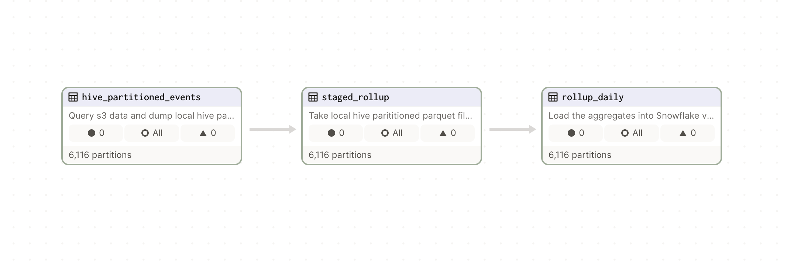

# Lean Data Engineering

Example code to pair with Lean Data Engineering with Dagster and DuckDB on the [DataJargon Substack](https://datajargon.substack.com/)





## Getting started
This is a [Dagster](https://dagster.io/) project scaffolded with [`dagster project scaffold`](https://docs.dagster.io/getting-started/create-new-project).

First, install your Dagster code location as a Python package. By using the --editable flag, pip will install your Python package in ["editable mode"](https://pip.pypa.io/en/latest/topics/local-project-installs/#editable-installs) so that as you develop, local code changes will automatically apply.

```bash
pip install -e ".[dev]"
```

Then, start the Dagster UI web server:

```bash
dagster dev
```

Open http://localhost:3000 with your browser to see the project.


## Development


### Adding new Python dependencies

You can specify new Python dependencies in `setup.py`.

### Unit testing

Tests are in the `lean_data_eng_tests` directory and you can run tests using `pytest`. In a real world setting, more tests would be warranted.


```bash
pytest lean_data_eng_tests
```

### Schedules and sensors

If you want to enable Dagster [Schedules](https://docs.dagster.io/concepts/partitions-schedules-sensors/schedules) or [Sensors](https://docs.dagster.io/concepts/partitions-schedules-sensors/sensors) for your jobs, the [Dagster Daemon](https://docs.dagster.io/deployment/dagster-daemon) process must be running. This is done automatically when you run `dagster dev`.

Once your Dagster Daemon is running, you can start turning on schedules and sensors for your jobs.

## Deploy on Dagster Cloud

The easiest way to deploy your Dagster project is to use Dagster Cloud.

Check out the [Dagster Cloud Documentation](https://docs.dagster.cloud) to learn more.


## Misc.
In the case that you a running into an error like `Symbol not found: _CFRelease` (this may happen with Conda/ Anaconda environments), you likely have an issue with GRPC. 
```
pip uninstall grpcio
conda install grpcio
```
When upgrading Dagster to >= 1.5, you may need to address this in a different way. [See thread](https://github.com/Chainlit/chainlit/issues/56#issuecomment-1752316503)
```
pip uninstall grpcio
# Add these to your env or .zshrc
export GRPC_PYTHON_BUILD_SYSTEM_OPENSSL=1
export GRPC_PYTHON_BUILD_SYSTEM_ZLIB=1
export GRPC_PYTHON_LDFLAGS=" -framework CoreFoundation"
3. pip install grpcio --no-binary :all:
```